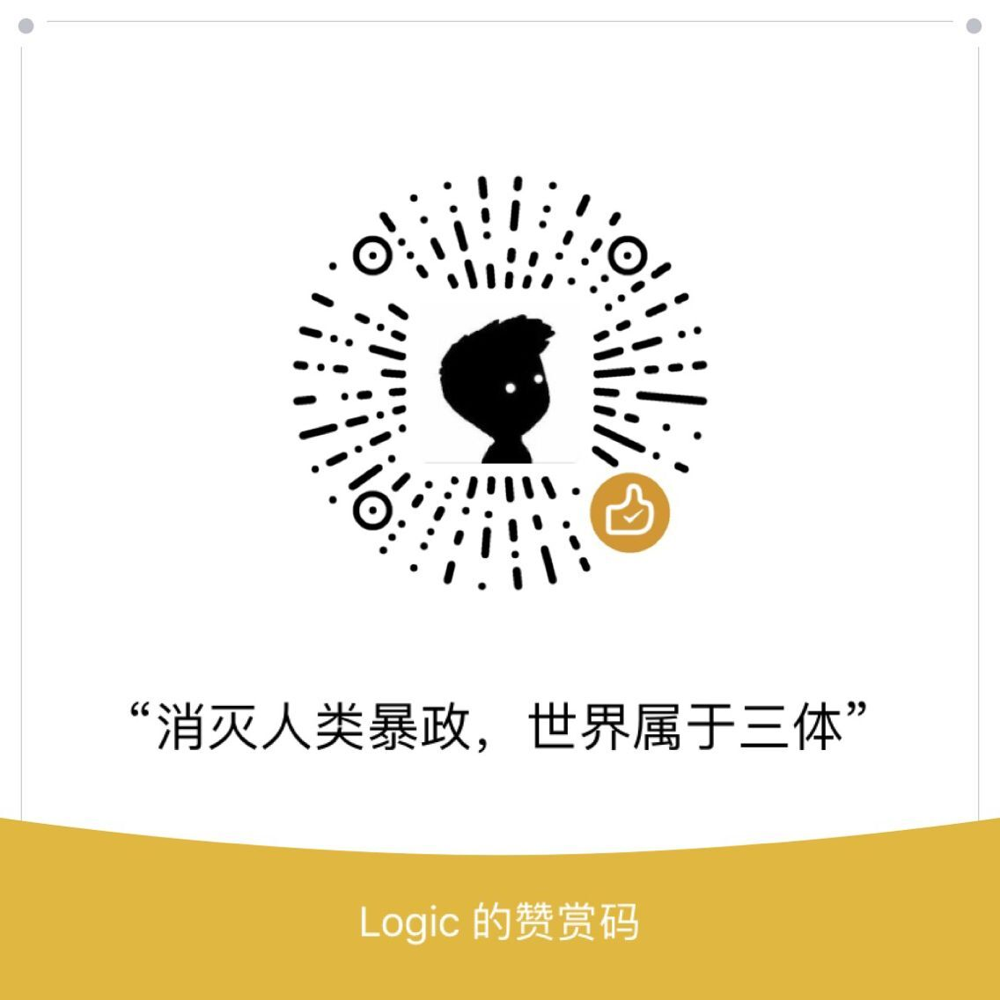
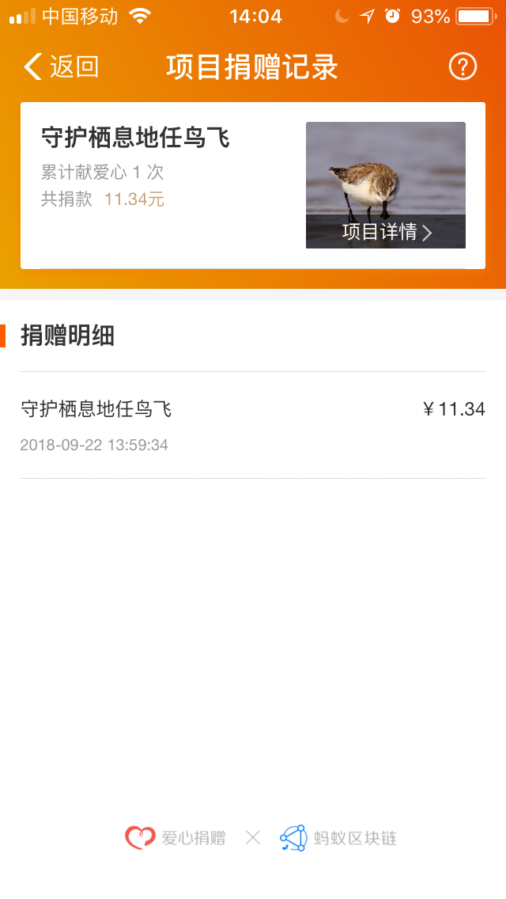
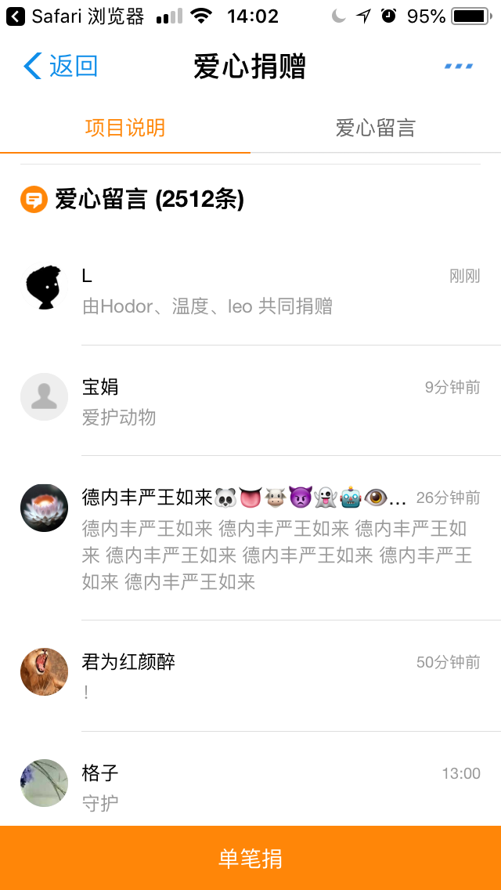

# waterdrop 3D

这是一个关于《三体》水滴的网站 
初版 做完了

* 老夫就是要用jquery
* THREE.JS v92, IE11+以上支持
* 页面排版 简单排了排，没有什么设计能力

### 地址
https://isluo.com/work/water

### 关于《三体》
《三体》是刘慈欣 大刘的长篇科幻小说，共3部。获得了星云奖、雨果奖等国际奖项。

> 初次看见《三体》时，是在上初三的时候，借的同学的《科幻世界》杂志，第1篇文章就是《三体》,看了一遍，发现讲的是文化大革命，耐着性子看完了第1集，根本没出现任何"科幻"的东西。 
> 十几年匆匆而过，直到我参加工作了，才重新想起三体，发现已经完结了。于是抄起手机就开始看。哇塞，我觉得这就是想象力的极限了，我沉浸其中无法自拔。 
> 人的一生是多么短暂呵，在那遥远的时间的终点，会否有一个人在等我呢。

### 版权及免责声明
* 本网站是根据刘慈欣《三体》中的情节构建的，摘抄了部分原文。 
* 图片均来源于网络 
* 本网站仅作为我的个人作品,如有侵权请联系我。 
* 本网站源代码可随意转发修改
 

 

* 微信扫一扫上方二维码可小额赞赏我。
* 赞赏任一金额，你的微信昵称将显示在本网站赞助者名单中
* 所得资金不会用于帮助任何人类
* 所有资金将用于流浪小猫小狗和自然环境保护计划（我会通过阿里巴巴公益或腾讯公益捐出去，会附上赞助者的昵称）
* 资金流向及查询后续会公布在下方:

> 2018/06/25 <a href="https://ds.alipay.com/?scheme=alipays%3A%2F%2Fplatformapi%2Fstartapp%3FappId%3D10000009%26url%3D%252Fwww%252Ffeedback.htm%253FdonateId%253D2017082413435248543%2526__from__%253Dshare" target="_blank">给流浪狗狗一顿饱饭</a> (需手机上点击自动跳转支付宝，比较麻烦，不过我也截图了)

  

> 2018/09/22 《守护栖息地任鸟飞》支付宝公益“大自然保护”板块

  
