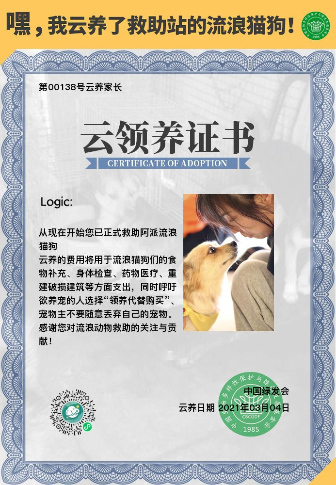
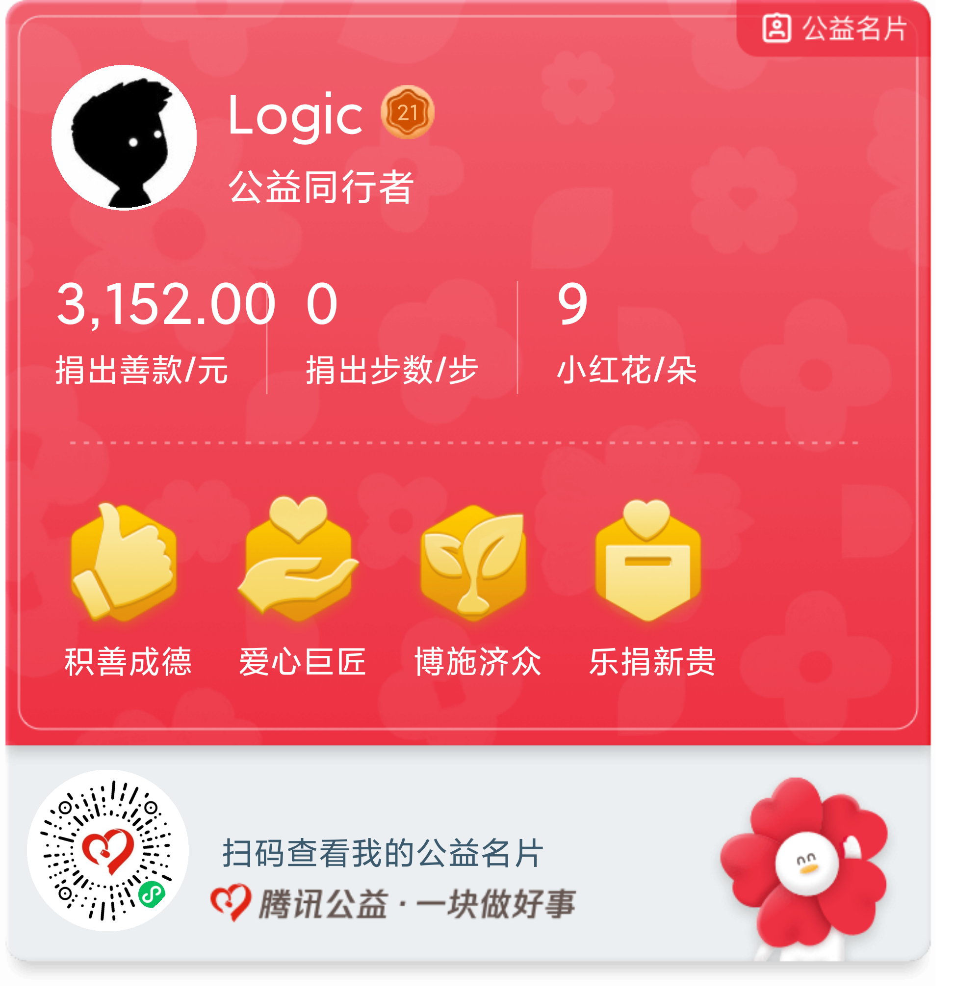

# waterdrop 3D

这是一个关于《三体》水滴的网站 
初版 做完了

- 老夫就是要用 jquery
- THREE.JS v92, IE11+以上支持
- 页面排版 简单排了排，没有什么设计能力

## 地址

国际：https://isluo.com/work/water/

## 关于《三体》

《三体》是刘慈欣 大刘的长篇科幻小说，共 3 部。获得了星云奖、雨果奖等国际奖项。

> 初次看见《三体》时，是在上初三的时候，借的同学的《科幻世界》杂志，第 1 篇文章就是《三体》,看了一遍，发现讲的是文化大革命，耐着性子看完了第 1 集，根本没出现任何"科幻"的东西。 
> 十几年匆匆而过，直到我参加工作了，才重新想起三体，发现已经完结了。于是抄起手机就开始看。哇塞，我觉得这就是想象力的极限了，我沉浸其中无法自拔。 
> 人的一生是多么短暂呵，在那遥远的时间的终点，又会有怎样的光景呢。

## 版权及免责声明

- 本网站是根据刘慈欣《三体》中的情节构建的，摘抄了部分原文。 
- 图片均来源于网络 
- 本网站仅作为我的个人作品,如有侵权请联系我。 
- 本网站源代码可供转发修改，但不得用于商业用途
 
 

 

- 微信扫一扫上方二维码可小额赞赏我。
- 赞赏任一金额，你的微信昵称将显示在本网站赞助者名单中
- 所得资金不会用于帮助任何人类
- 所有资金将用于流浪小猫小狗和自然环境保护计划（我会通过阿里巴巴公益或腾讯公益捐出去，会附上赞助者的昵称）
- 资金流向及查询后续会公布在下方。
     

## 赞助者名单

<kbd>滴滴香小单(水滴计划由蓝色空间号独家赞助)</kbd>&nbsp;
<kbd>科捷智能科技-葛晋 Momiji</kbd>&nbsp;
<kbd>卡斯特梅的雨</kbd>&nbsp;
<kbd>T-800</kbd>&nbsp;
<kbd>HK</kbd>&nbsp;
<kbd>Hodor</kbd>&nbsp;
<kbd><a href="http://www.sci-fifans.net" target="_blank" rel="noopener">Alnitak(THE WARTERDROP)</a></kbd>&nbsp;
<kbd>佚名</kbd>&nbsp;
<kbd>Logic</kbd>&nbsp;
<kbd>希望重燃.</kbd>&nbsp;
<kbd>岁寒(:white_square_button:)</kbd>&nbsp;
<kbd>Rose Dry Leaf Gas(我们是同志了)</kbd>&nbsp;
<kbd>风(支持！)</kbd>&nbsp;
<kbd>Asphyxia.(朝歌还会远吗？)</kbd>&nbsp;
<kbd>小灰和小白的铲屎官(牛牛牛罗老师)</kbd>&nbsp;
<kbd>朱昀栎</kbd>&nbsp;
<kbd>CoderWangx(水滴很酷:thumbsup:)</kbd>&nbsp;
<kbd>欢乐正前方(加油！)</kbd>&nbsp;
<kbd>二爪</kbd>&nbsp;
<kbd>士大夫(大赞)</kbd>&nbsp;
<kbd>天将明(探索未知)</kbd>&nbsp;
<kbd>今天明天吃什么呢(专升本复习完善成个人笔记最好)</kbd>&nbsp;
<kbd>我的名字十二个字不信你数</kbd>&nbsp;
<kbd>把海弄干的鱼</kbd>&nbsp;
<kbd>傅 Fu(需要批发二向箔)</kbd>&nbsp;
<kbd>Citrus</kbd>&nbsp;
<kbd>王</kbd>&nbsp;
<kbd>吴(消灭人类暴政，世界属于三体)</kbd>&nbsp;
<kbd>moleQ(我又来了)</kbd>&nbsp;
<kbd>温度 ℃</kbd>&nbsp;
<kbd>企鹅丫丫 AVON</kbd>&nbsp;
<kbd>太苦特级方糖(希望捐给猫猫)</kbd>&nbsp;
<kbd>王宇晗</kbd>&nbsp;
<kbd></kbd>&nbsp;
<kbd>西瓜丸子</kbd>&nbsp;
<kbd>氕氘氚</kbd>&nbsp;
<kbd>真羽</kbd>&nbsp;
<kbd>浮生六记(ETO 成员前来报告)</kbd>&nbsp;
<kbd>Z(Hala Madrid)</kbd>&nbsp;
<kbd>小张</kbd>&nbsp;
<kbd>Z(现实与幻想并存)</kbd>&nbsp;
<kbd>Doggy(太牛了 woc)</kbd>&nbsp;
<kbd>Mr O'G 桑</kbd>&nbsp;
<kbd>Roland(消灭人类暴政，世界属于三体！)</kbd>&nbsp;
<kbd>23:33(太酷了)</kbd>&nbsp;
<kbd>care(鑫哥，你真棒)</kbd>&nbsp;
<kbd>leooo</kbd>&nbsp;
<kbd>小朋友真好吃(么么哒)</kbd>&nbsp;
<kbd>邶陂以北(真就这些，不多，世界属于三体，跃迁中)</kbd>&nbsp;
<kbd>\~科 24\~</kbd>&nbsp;
<kbd>呐-是小中(66)</kbd>&nbsp;
<kbd>veer</kbd>&nbsp;
<kbd>dragon.(加油鸭)</kbd>&nbsp;
<kbd>青城山下㇏(冲鸭！孟照森！)</kbd>&nbsp;

   
（如果您看不到图片，可能需要科学上网）  

> 2018/06/25 <a href="https://ds.alipay.com/?scheme=alipays%3A%2F%2Fplatformapi%2Fstartapp%3FappId%3D10000009%26url%3D%252Fwww%252Ffeedback.htm%253FdonateId%253D2017082413435248543%2526__from__%253Dshare" target="_blank">给流浪狗狗一顿饱饭</a> (需手机上点击自动跳转支付宝) ￥ 12.01

 

> 2018/09/22 《守护栖息地任鸟飞》支付宝公益“大自然保护”板块 ￥ 11.34

 

> 2021/03/04 阿派流浪猫狗救助站 中国绿发会。￥ 120

> 资金已全部捐出，虽然是以我的账号捐的，但由衷感谢所有赞助者。

